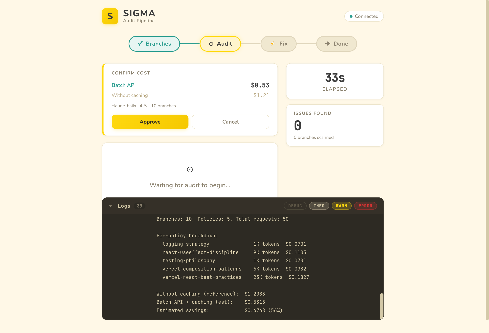
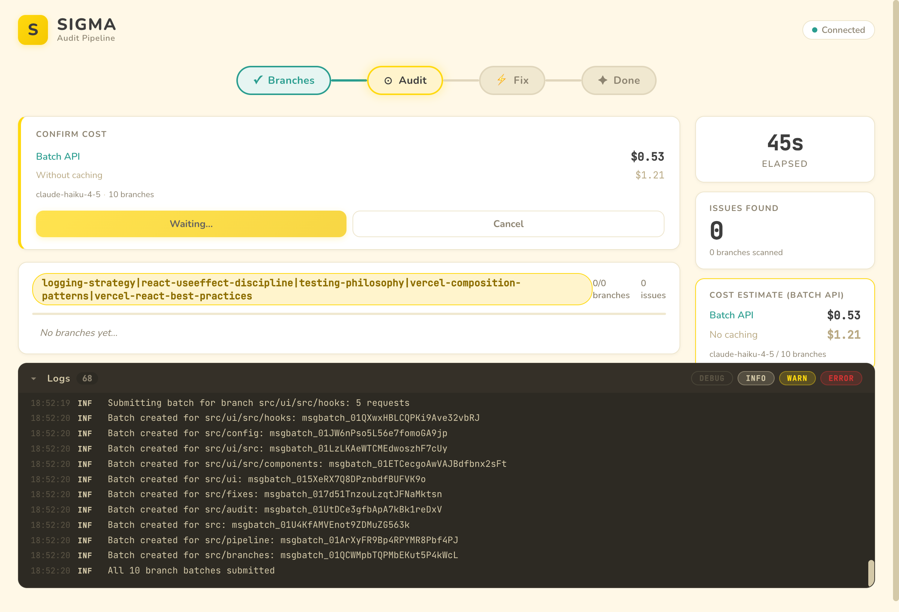
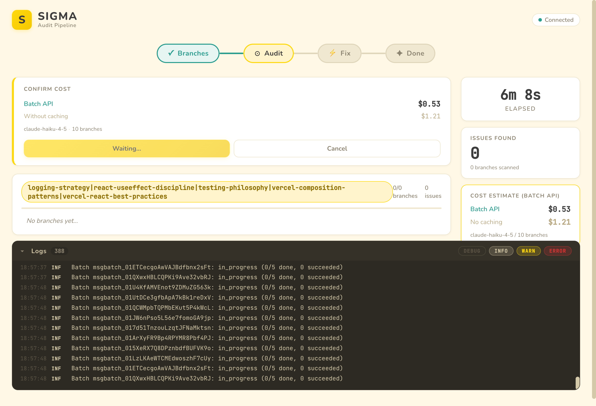
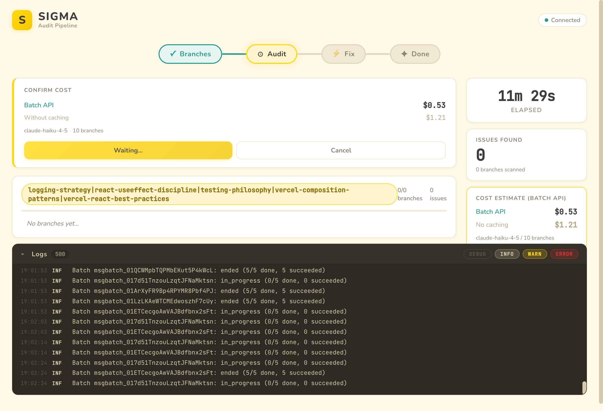
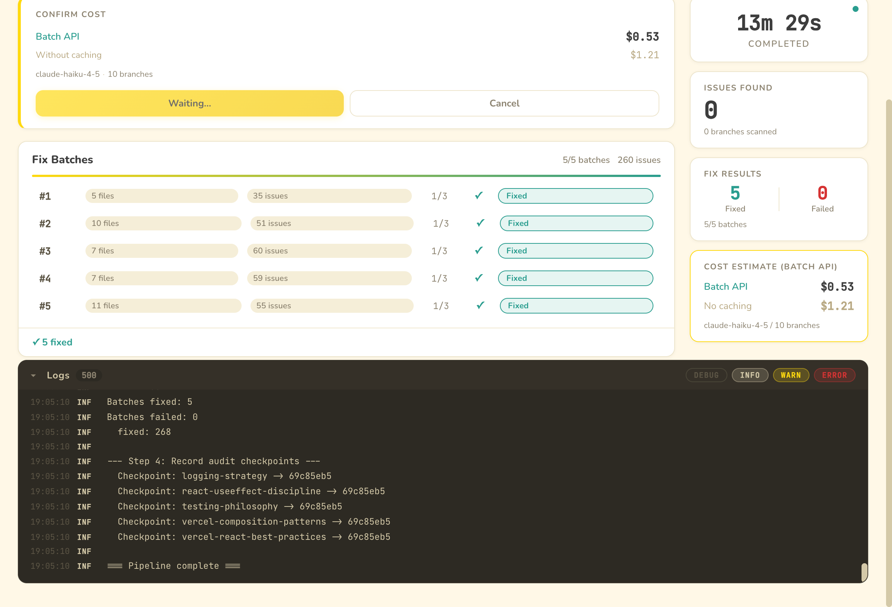
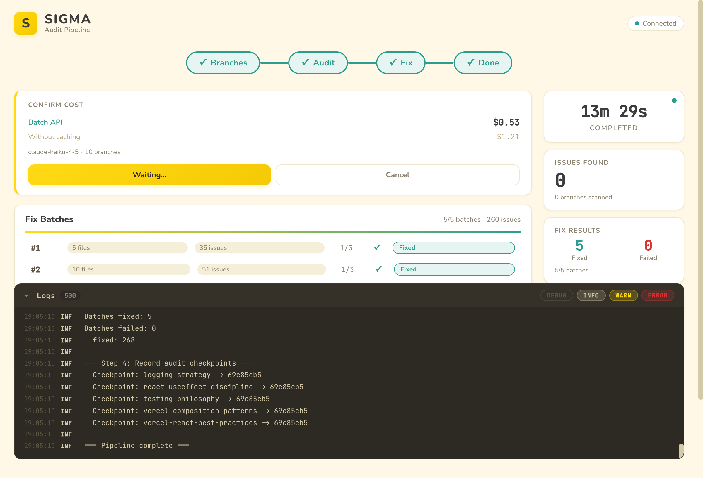

# SIGMA Audit Pipeline — Visual Walkthrough

This document walks through a complete run of the SIGMA audit pipeline against 5 policies, captured from the live progress UI using browser automation. The pipeline ran against the `src/` directory of the audit tool itself.

**Run summary:** 10 branches, 5 policies, 50 batch requests, 260 issues found, 268 fixed, completed in ~13.5 minutes.

---

## 1. Initial Load & Connection


When the pipeline starts (`bun run all`), it launches a Bun HTTP server on a random port and opens the browser automatically. The React SPA connects via Server-Sent Events (SSE).

**What's visible:**
- **SIGMA header** with "Connected" status indicator (green dot, top-right)
- **Pipeline stepper**: Branches (completed, checkmark), Audit (active), Fix, Done
- **Cost confirmation card** — the pipeline has already generated branches and computed the cost estimate
- **Sidebar**: Elapsed timer, Issues Found counter (0), branches scanned (0)
- **Log stream** (bottom): Scrolling log output showing branch generation

By the time the browser connects, branch generation (Step 1) has already completed — the `src/` directory was split into 10 branches, each under the 3000 LOC threshold.

---

## 2. Cost Confirmation



The pipeline pauses before executing any Anthropic API calls, presenting a cost confirmation card. This is the single confirmation gate for all 5 policies.

**Cost breakdown:**
| Metric | Value |
|---|---|
| Model | claude-haiku-4-5 |
| Branches | 10 |
| Batch API (with caching) | **$0.53** |
| Without caching (reference) | $1.21 |

**Per-policy token estimates** (visible in the log stream):
| Policy | Tokens | Cost |
|---|---|---|
| logging-strategy | 1K | $0.07 |
| react-useeffect-discipline | 9K | $0.11 |
| testing-philosophy | 1K | $0.07 |
| vercel-composition-patterns | 6K | $0.10 |
| vercel-react-best-practices | 23K | $0.18 |

The user can click **Approve** to proceed or **Cancel** to abort. The same confirmation is available via the CLI stdin prompt (`Proceed with batch audit? [Y/n]`).

---

## 3. Audit Begins — Batch Submission



After clicking **Approve**, the pipeline submits all 10 branch batches to the Anthropic Batch API. Each batch contains 5 requests (one per policy).

**Key UI elements:**
- The Approve button changes to a yellow **"Waiting..."** indicator
- All 5 policy names appear in the audit progress row
- The log stream shows batch IDs being created: `msgbatch_01...` for each branch
- "All 10 branch batches submitted" confirms the full submission

The Batch API processes requests asynchronously — the pipeline polls each batch at regular intervals.

---

## 4. Audit Progress — Polling Batches



During the audit phase, the pipeline polls each batch for completion status. The log stream shows the poll cycle:

```
Batch msgbatch_01...: in_progress (0/5 done, 0 succeeded)
```

As batches complete, the status changes to:

```
Batch msgbatch_01...: ended (5/5 done, 5 succeeded)
```



At ~11 minutes, most batches have completed. The Anthropic Batch API typically processes requests within 5-15 minutes. The pipeline continues polling until all 10 batches have ended.

**Sidebar updates:** The elapsed timer continues counting. The "Cost Estimate (Batch API)" section appears in the sidebar showing the approved costs.

---

## 5. Fix Phase — All Batches Fixed



After all audit batches complete, the pipeline enters the **Fix** phase. The fix executor spawns Claude CLI in agentic mode for each batch, applying remediations with up to 3 retry attempts.

**Fix batch details:**

| Batch | Files | Issues | Attempts | Status |
|---|---|---|---|---|
| #1 | 5 files | 35 issues | 1/3 | Fixed |
| #2 | 10 files | 51 issues | 1/3 | Fixed |
| #3 | 7 files | 60 issues | 1/3 | Fixed |
| #4 | 7 files | 50 issues | 1/3 | Fixed |
| #5 | 11 files | 55 issues | 1/3 | Fixed |

All 5 batches were fixed on the first attempt (1/3). The sidebar shows **Fix Results: 5 Fixed, 0 Failed**.

---

## 6. Pipeline Complete



The pipeline finishes with all 4 stepper phases checked:

- **Branches** — 10 branches generated from `src/`
- **Audit** — 50 requests across 5 policies, all succeeded
- **Fix** — 5 batches, 260 issues, all fixed
- **Done** — Checkpoints recorded

**Final log entries:**
```
=== FIX SUMMARY ===
Batches fixed: 5
Batches failed: 0
  fixed: 268

--- Step 4: Record audit checkpoints ---
  Checkpoint: logging-strategy -> 69c85eb5
  Checkpoint: react-useeffect-discipline -> 69c85eb5
  Checkpoint: testing-philosophy -> 69c85eb5
  Checkpoint: vercel-composition-patterns -> 69c85eb5
  Checkpoint: vercel-react-best-practices -> 69c85eb5

=== Pipeline complete ===
```

**Completed in 13 minutes 29 seconds** at an estimated cost of $0.53.

---

## Pipeline Lifecycle Summary

```
bun run all
  |
  +-- Step 1: Generate branches (split src/ into 10 branches under MAX_LOC=3000)
  |
  +-- Step 2: Audit
  |     |-- Compute cost estimate ($0.53 batch API, $1.21 without caching)
  |     |-- Emit cost:confirm-request event -> UI shows Approve/Cancel
  |     |-- User clicks Approve (or types Y at CLI)
  |     |-- Submit 10 batch requests (5 policies each) to Anthropic Batch API
  |     |-- Poll batches until all complete (~10 min)
  |     \-- Parse structured JSON results, store in audit.db
  |
  +-- Step 3: Fix
  |     |-- Group issues into 5 fix batches
  |     |-- For each batch, spawn Claude CLI in agentic mode
  |     |-- Retry up to 3 times, run `bun check` after each
  |     \-- All 5 batches fixed on first attempt
  |
  +-- Step 4: Record checkpoints
  |     \-- Write policy -> commit hash mappings to audit.db
  |
  \-- Pipeline complete (13m 29s, $0.53)
```

---

## Captured Artifacts

| File | Description |
|---|---|
| `walkthrough/01-initial-load.png` | Header, stepper, cost card, log stream |
| `walkthrough/02-cost-confirmation.png` | Cost confirmation with per-policy breakdown |
| `walkthrough/03-approved-audit-starting.png` | Batch submission in progress |
| `walkthrough/04-audit-progress.png` | Batch polling during audit phase |
| `walkthrough/04b-audit-batches-completing.png` | Batches ending (5/5 done) |
| `walkthrough/05-fix-progress.png` | All 5 fix batches with results |
| `walkthrough/06-complete.png` | Final state with all phases complete |
| `walkthrough/pipeline.log` | Full CLI output from the pipeline run |
